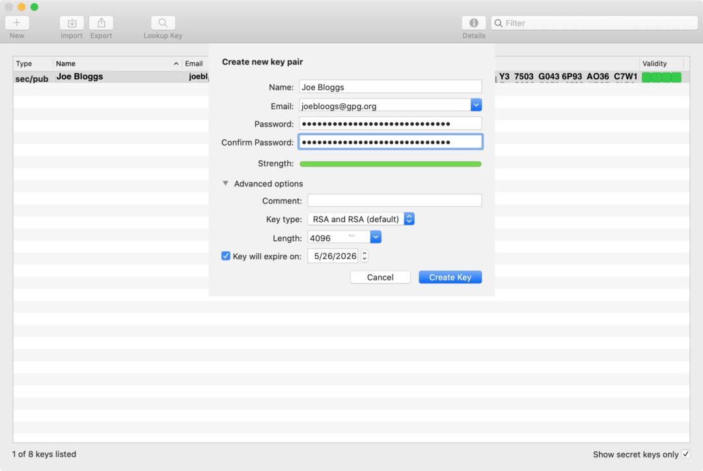

# GPG Encryption 101

[GnuPG, popularly known as GPG](https://gnupg.org/), is an extremely versatile encryption tool. It is widely used as the industry standard for encryption for things like emails, messages, files, or just anything you need to send to someone securely.

This tutorial will cover using GPG on a MacOS system both via the gui application and the command line.This will get you familiar with the basics of encryption and signature verification, sending private messages and some privacy best practices. 

So why do we need GPG?

## Some first principles

> "Privacy is necessary for an open society in the electronic age. Privacy is not secrecy. A private matter is something one doesn't want the whole world to know, but a secret matter is something one doesn't want anybody to know. Privacy is the power to selectively reveal oneself to the world."

This is the opening line of [A Cypherpunk's Manifesto](https://nakamotoinstitute.org/cypherpunk-manifesto/) by Eric Hughes in 1993. The original cypherpunks believed that privacy was not only a necessity in the digital age but a basic human right. One of their ambitions was to create a digital money which could be transacted without the need for a trusted third party.  

Bitcoin is the solution to this problem. Ultimately what it set put to solve was the problem of double spending, but it did so by using digital signatures in an *open peer-to-peer network*. 

Satoshi Nakamoto wrote about privacy in Bitcoin’s Whitepaper:

> “Some linking of transactions to a common owner is still unavoidable, and could reveal other transactions that belonged to the same owner”

While private transactions on Bitcoin network are not fully anonymous, it is our responsibility as individuals to understand why encryption matters for a trustless network to function.

Privacy in the digital age requires cryptography. This allows us to reveal our data and identity when desired and only to whom desired. This is the essence of privacy. 

## Some basics 

Encryption is the process of converting data into secret, incomprehensible code such that only intended parties are capable of understanding the information. 

The [GPG Tools support](https://gpgtools.tenderapp.com/kb/how-to/introduction-to-cryptography#p1) provides a fantastic rabbit hole to dive deeper into the technicalities of cryptography, hash functions, digital certificates etc. 

We will cover many of these topics here but with a focus on the tools and application of them using the command line and some basic exercises. 

## How to use GPG encryption 

GPG keys work by using two files, a private key and a public key. These two keys are tied to each other, and are both needed to use all of GPG’s functionality, notably encrypting and decrypting files.

## Installing the GPG suite 

We will first start with getting familiar with the [GPG Suite](https://gpgtools.org/) gui application to create and manage our keys and do some basic encryption and decryption exercises. 

Go to the link and follow the download instructions. 

## Creating a New Keypair 

## Managing keys

 ## Encrypting and decrypting

 ## Verifying signatures

 ## Using GPG in the command line

 ## Attaching GPG to your GitHub 

